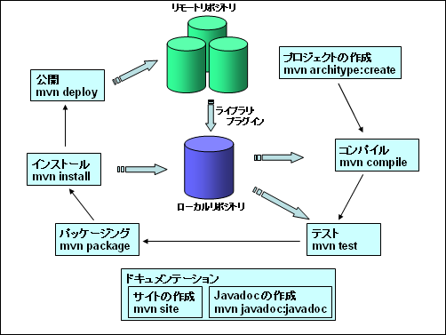

# Mavenとは
## アーキテクチャ



参考）
* [Mavenとは何ぞや](https://qiita.com/ASHITSUBO/items/6c2aa8dd55043781c6b4)

## プロジェクトの作成

```bash
mvn archetype:create -DgroupId=com.example -DartifactId=sample
```

groupIdにはルートパッケージ名、artifactIdにはプロジェクト名を指定

## pom(Project Object Model)とは

プロジェクトに関する情報をpom.xmlで管理する。
作成物はsrcディレクトリ配下に配置する

src/main/java : javaのコードを格納
src/test/java : javaのテストコードを格納

## pomの要素

|要素|意味|
|:-:|:-:|
|`model version`|pomのバージョン|
|`groupId`|プロジェクトのルートパッケージ名|
|`artifactId`|プロジェクト名.jarの名前になる|
|`packaging`|パッケージタイプ（jar, war, ear等）|
|`version`|プロジェクトのバージョン|
|`name`|プロジェクトの表示名（ドキュメントに使用）|
|`url`|プロジェクトのサイトのURL（ドキュメントに使用）|
|`dependencies`|プロジェクトが依存するライブラリの情報|