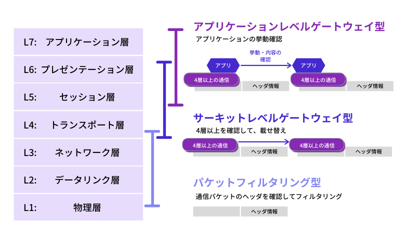
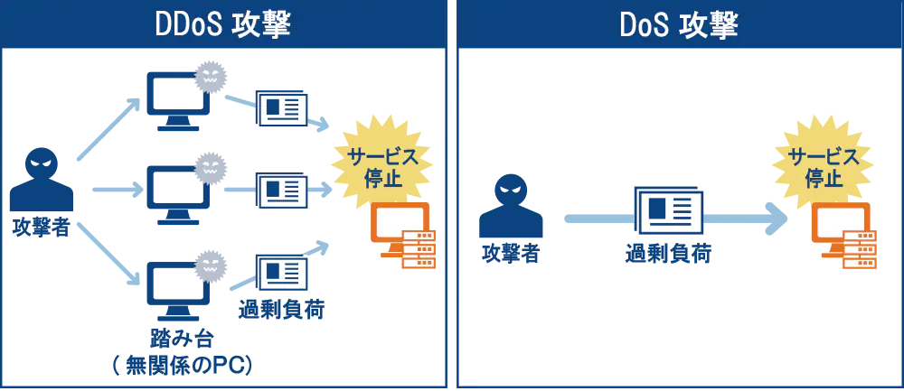

# AWS セキュリティグループ

## 前提知識

### トラフィック

ネットワーク上の情報、またはその情報量のこと。

> 通信の分野におけるトラフィックとは、インターネットやLANなどのコンピューターなどの通信回線において、一定時間内にネットワーク上で転送されるデータ量のことを意味します。

引用元: https://www.idcf.jp/words/traffic.html

### ファイアウォール(Firewall)

ネットワーク上の通信を許可または拒否する判断を行う機能。検問所のイメージ

> ファイアウォールは、ネットワークの通信において、その通信をさせるかどうかを判断し許可するまたは拒否する仕組みです。

引用元: https://www.soumu.go.jp/main_sosiki/joho_tsusin/security/basic/structure/01.html

ファイアウォールの仕組みには大きく以下の3種類がある。

1. パケットフィルタリング
    - ヘッダの送信元情報を解析して通信許可するかどうかを判断する
    - 通信を許可するパケット情報のIPアドレスやポート番号を設定し、フィルタリングルールを設定することが可能
    - 設定が難しくセキュリティホール（設定ミスによる抜け穴）が生じやすい
2. アプリケーションレベルゲートウェイ
   - データ部分までチェックして通信を制御を行う
   - アプリケーションのプロトコルごとに設定が必要
   - プロキシサーバー経由で接続を行い、サービスごとに認証を行う
   - ゲートウェイ処理をアプリケーションが実行するため負荷は高い
3. サーキットレベルゲートウェイ
   - トランスポート層での通信を監視・制御する方式
   - コネクション単位の制御が可能で、任意のポートに関する通信の可否を制御できる
   - パケットフィルタリングよりも設定や管理が簡単
   - 専用ソフトウェアがクライアント側に必要になる場合がある

画像引用元: https://www.rworks.jp/system/system-column/sys-entry/21277/

## セキュリティグループとは

1つ以上のインスタンスのトラフィックを制御するための仮想ファイアウォール。

以下の設定が可能

- インスタンスアクセスの許可ルールを指定できる
  - 拒否ルールは指定できない
- インバウンドルール・アウトバウンドルールをそれぞれ設定できる
- デフォルト設定
  - インバウンド：すべて「拒否」。ホワイトリスト方式
  - アウトバウンド：すべて「許可」
- セキュリティグループはステートフル
  - インスタンスからリクエストを送信する場合、レスポンスはインバウンドルールにかかわらず許可される

## AWS Shield

マネージド型のDDoS攻撃に対する防護サービス

- サービスはStandard（無償）とAdvanced（有償）の2つがある
- Advancedの特徴
  - DDoS対応チームによるサポート
  - DDoS攻撃によるコスト増加分の払い戻し
  - AWS WAF を無料で無制限利用が可能

### DDoS Attack(Distributed Denial of Service attack)

DDos攻撃とは、ネットワークのトラフィック（通信量）を増大させ、通信を処理しているコンピューティングリソースに負荷をかけることによってサービスを利用困難にしたり、ダウンさせたりする攻撃のこと。
複数のコンピュータを乗っ取り踏み台にして攻撃するのが特徴。

画像引用元: https://www.ntt.com/business/services/network/internet-connect/ocn-business/bocn/knowledge/archive_18.html

> #### DDoS攻撃をする理由は？
> この厄介なDDoS攻撃、そもそも誰がなんの目的で行なっているのでしょうか。
> 考えられる理由は下記5つです。
>
> ##### 単純な嫌がらせ
> そもそもDDoS攻撃だけでは、マルウェアのように不正にデータを盗んだり、改ざんしたり、消去したりといったクラッキング行為を行うことはできません。
> 嫌がらせの動機は様々でしょうが、サイト運営者が困ることを目的としてDoS攻撃またはDDoS攻撃を仕掛ける人が一定数存在しています。
>
> ##### 妨害行為
> 競合サイトをアクセスしづらい状態にするなどなんらかの営利目的を持っての妨害行為としてDDoS攻撃を仕掛ける場合があります。ライバル企業の犯行の可能性が疑われることも珍しくありません。
>
> ##### 抗議活動
> そのサイトの運営元に対するなんらかの抗議活動としてDDoS攻撃を仕掛ける場合があります。
> 政治問題に対する抗議活動として、DDoS攻撃を仕掛ける事例は過去に様々な国の政府を対象に実行されています。
>
> ##### 脅迫行為
> 企業などの特定の組織に対して、DDoS攻撃を事前に予告し、DDoS攻撃を引き換えにして身代金等様々な脅迫行為を行う場合があります。
> 特に2017年から仮想通貨サイトやFXサイトに対して、DDoS攻撃を悪用した脅迫行為が相次いでいます。
> https://www.jpcert.or.jp/newsflash/2017092101.html

引用元: https://www.shadan-kun.com/blog/measure/2160/

DDos攻撃対策

- 送信元IPを特定の国のみに制限する
  - Dos攻撃に対しては特定のIPを拒否で対策が可能
- DDoS対策サービスを利用する

## AWS WAF(Web Application Firewall)

Webアプリケーションの脆弱性を突いた攻撃から保護するための、マネージド型のWebアプリケーションファイアウォールのサービス

- SQLインジェクションやクロスサイトスクリプティング(XSS)などの攻撃をブロックするセキュリティルールを作成できる
- アプリケーションレベルでの解析が可能
- 基本利用料は無料だが、Webセキュリティルールの指定に応じて課金が必要
  - Web ACL数に基づく課金: 5.00USD / 月
  - Web ACLごとに追加するルール数: 月0.60USD / 月
  - 受け取るWebリクエスト数に基づく課金: 月5.00USD / 100万リクエスト
  - ※上記は2021/05/09時点の料金です
- 以下のサービスにおけるウェブリクエストをWeb ACLにより制御する
  - CloudFront
  - Application Load Balancer
  - API Gateway
- Webセキュリティルール（許可、ブロック等）の設定はユーザーが行う

参考: https://aws.amazon.com/jp/waf/

## AWS API Gateway

RESTおよびWeb Socket APIの作成、公開、保守等を行うフルマネージドサービス

## Amazon Inspector

EC2上にあるアプリケーションのセキュリティとコンプライアンスを向上させるための脆弱性自動診断サービス

- 評価はスケジューリングの設定により自動で行える
- 脆弱性の定義となるナレッジベースがある。AWSのセキュリティ研究者により定期的に更新される
- PCI DSSに関するチェックも可能
  - PCI DSS(Payment Card Industory Data Security Standard)とはクレジットカード会員の情報を保護することを目的に定められたクレジットカード業界の情報セキュリティ基準

## AWS Artifact

コンプライアンスレポートを確認・ダウンロードできるサービス
