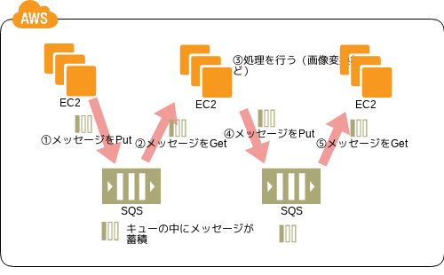

# AWSクラウドの概念

## AWSとは

Amazon社が提供しているクラウドサービスの総称

※クラウドサービスとは、インターネットを経由してコンピューティング、データベース、ストレージ、アプリケーション等のITリソースをオンデマンドで(必要に応じて必要な分だけ)利用することのできるサービスの総称

## AWSの6つのメリット

1. 固定費(設備投資費)が変動コストに
   - 利用した分だけの支払いでOKになる
2. スケールによるコストダウン
   - 多くのユーザーが利用するため、徐々に安くなっていく(「規模の経済」によるコストメリットが生じる)
        ※規模の経済 ： 生産規模を増やすほど単価コストが減少すること
3. キャパシティ予想が不要に
   - 必要に応じてスケールアップ・スケールダウンを行えば良いので予測を行う必要が無い
4. 速度と俊敏性の向上
   - ITリソースをすぐに調達できるため、ビジネスの速度が向上
5. データセンターの運用と保守への投資が不要
   - サーバーの管理が不要に
6. わずか数分でデプロイ
   - レイテンシーを抑えることが可能

参考: https://aws.amazon.com/jp/cloud/

## アーキテクチャの設計原理

### Desigin for Failure

故障に備えた設計のこと。単一障害点(停止するとシステム全体が停止してしまう部分)を作らないような設計とする。

1. 1つのデータセンターのみで運用しない
2. 単一のインスタンスのみで運用しない

## コンポーネントの分離

- クラウドアーキテクチャではサービス指向アーキテクチャの設計原則を踏襲する
- システムのコンポーネントは疎結合†にする
- キューイングチェーンを利用することで耐障害性を高めることが可能

画像引用元: http://aws.clouddesignpattern.org/index.php/CDP:Queuing_Chain%E3%83%91%E3%82%BF%E3%83%BC%E3%83%B3

† 疎結合: システム間の依存関係、関連性などが弱く、各々の独立性が高い状態のこと

## 弾力性の実装

- 弾力性(Elastic)または伸縮性とも言う
- リソースを柔軟にスケールアウト・スケールインできること

### 実装方式

1. 巡回スケーリング
   - 一定間隔ごとに発生する定期的なスケーリング
2. イベントスケーリング
   - 予定されたイベントに合わせたスケーリング
3. オンデマンドの自動スケーリング
   - 監視サービス(CloudWatch)のトリガーによるスケーリングを行う
    CPU使用率やネットワークI/O量などの監視項目に基づいてトリガーを送信し、AutoScalingで起動する。

## 並列化

- クラウドでアーキテクチャ設計を行う場合は、ロードバランサーを組み合わせて並列処理を行う
- スケーリングは弾力性を組み合わせて高負荷時にはスケールアウト・低負荷時にはスケールインを行う

用語|内容
-|-
スケールアップ|サーバスペック不足時にサーバのスペックを上げること
スケールダウン|サーバスペック不足時にサーバのスペックを下げてコストの適正化を図ること
スケールアウト|高負荷時にリクエストを処理するサーバー台数を増やすこと
スケールイン|低負荷時にリクエストを処理するサーバー台数を減らしてコストの適正化を図ること

## コンテンツ配置

- クラウドはネットワーク経由での利用になるため、配信時のオーバーヘッド等に対する対策が必要。
- 動的コンテンツをコンピュータ側、静的コンテンツをユーザー側の近くに配置する
  - 静的コンテンツはCloudFront(CDN)を利用し、

### CDN(Content Delivery Network)

キャッシュサーバーが世界中に配置され、ネットワーク的にエンドユーザーとの距離が近いキャッシュサーバーからWebコンテンツを取得する仕組み

## AWS Well-Architectedフレームワーク

信頼性、セキュリティ、効率、コスト効果が高いシステムを設計し、クラウドで運用するためにAWSにより作られたアークテクチャのベストプラクティス。

1. 運用上の優秀性
   - システムを稼働およびモニタリングする能⼒
2. セキュリティ
   - 情報、システム、資産を保護する能力
3. 信頼性
   - サービスが期待通りに継続して動作する能力(サービスの障害からの復旧等)
4. パフォーマンス効率
   - システムの要件を満たすためにコンピューティングリソースを効率的に使⽤する能力(要求の変化やテクノロジーの進化に対するものも含む)
5. コスト最適化
   - 最も安価にシステムを運⽤して、ビジネス価値を実現する能⼒

参考: https://aws.amazon.com/jp/architecture/well-architected/
