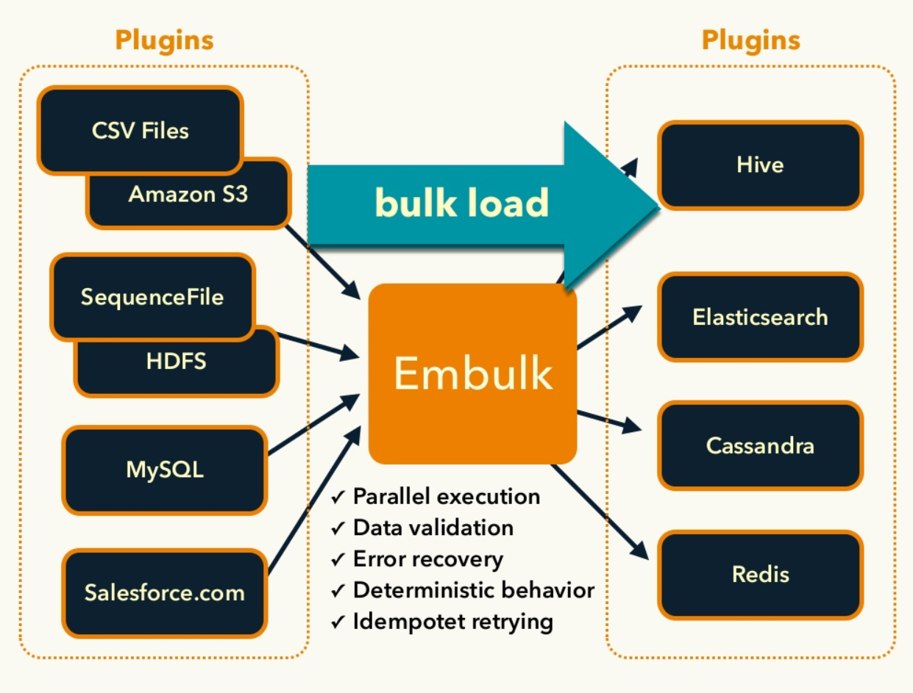

# Embulk
## Embulkとは?

- バッチ処理に特化した並列データ転送ツール(ETL)
- 大量に投入(bulk insert)されたデータを細かく圧縮し、並列で取り込むこと(bulk load)ができる
- Fluentdを制作しているTreasure Dataが開発



画像引用元： [Embulk, an open-source plugin-based parallel bulk data loader](https://www.slideshare.net/frsyuki/embuk-making-data-integration-works-relaxed?ref=https://www.embulk.org/)

## Embulkの特徴

- ストレージのbulk処理に特化
- 巨大なデータの並列分散処理を実現
- トランザクション制御あり
  - 全て成功しなかったら実行前の状態に巻き戻る
  - 失敗したタスクだけを後からやり直すレジューム機能
- guess機能
  - 入力データを自動で推定し、設定ファイルを生成
- オープンソース
- 本体とは別にプラグインを追加することで動作する
  - プラグインはruby, javaで書かれていて、実装自体も比較的容易

## Embulkのインストール

- java8をインストールする

下記サイトからamazon corretto 8をインストールする(Macの場合はMac版のダウンロードリンクから取得)
https://docs.aws.amazon.com/ja_jp/corretto/latest/corretto-8-ug/downloads-list.html

### java8へのパスを通す

- .zshrcに下記を追記する

```sh
export JAVA_HOME=`/usr/libexec/java_home -v 1.8`
```

- パス設定を反映

```sh
source ~/.zshrc
```

### Embulkインストール

- 下記コマンドで、Embulkをダウンロードして配置して、~/bin配下に配置する

```sh
curl --create-dirs -o ~/bin/embulk -L "https://dl.embulk.org/embulk-latest.jar"
chmod +x ~/bin/embulk
```

- Embulkのパスを通す

以下の対応でもOK

```sh:.zshrc
# install embulk
export PATH="$HOME/.embulk/bin:$PATH"
```

### Embulkプラグイン用のバンドルを作成

```sh
embulk mkbundle bundle
```

### Gemfileを修正してプラグインをインストールする

```sh
cd bundle
vi Gemfile
```

- Gemfileを修正する

```txt
source 'https://rubygems.org/'

gem 'embulk', '< 0.10'

# output
gem 'embulk-output-command'
```

- プラグインをバンドルインストール

```sh
embulk bundle install --path=vendor/bundle
embulk bundle list
```

### プラグインの更新

```sh
embulk bundle update
```

※Gemfileにはgem embulkがないとエラーになる

### サンプルデータを作成する

```sh
embulk example test
```

### guessコマンドでデータ定義を推測して定義ファイルを生成する

```sh
embulk guess -b bundle test/seed.yml -o test/config.yml
```

### プレビューを実行する

```sh
embulk preview -b bundle test/config.yml
```

### 実行する

```sh
embulk run -b bundle test/config.yml
```

### .envで読み込んだ変数を使用する

- .envを作成する

```txt
SAMPLE="sample_"
```

- test/config.yml.liquidを作成する

sample_の部分を `env.SAMPLE` へ変更する

- init.shを作成する

```sh
embulk -Einit.sh run -b bundle test/config.yml.liquid
```
