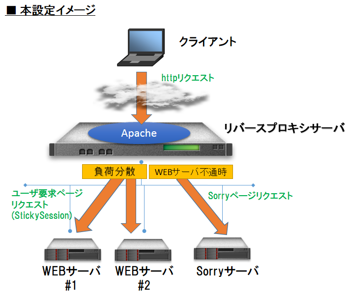

# Webサーバーのしくみ

## Webサーバーとは

* httpというプロトコル（ルール）に従って送信されたリクエスト（要求）に対して、レスポンス（応答）を返すソフトウェアのこと
* Webサーバーがインストールされたコンピュータ自体のことも同様にWebサーバーと呼ぶ。

## CGI(Common Gateway Interface)

* Webサーバー上でユーザープログラムを動作させる仕組み
* CGIプログラムはクライアントからのリクエストに応じて起動する
* CGIプログラムへの情報はコマンドライン引数を環境変数、標準入力で入力する
  * このデータはhttpヘッダで始まる必要がある
  * htmlの割合が圧倒的に多い
* Webサーバーが外部のプログラムを呼び出すという流れのため負荷が大きい
  * 代替としてアプリケーションサーバーを別に起動し、フロントのhttpサーバーをリバースプロキシとして動作させる、などの手段が多く取られる

